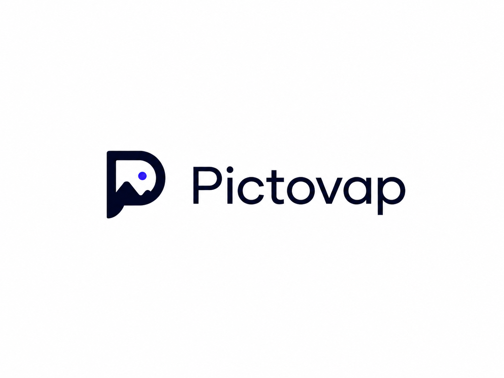

# Pictovap

<p align="center">
  
</p>

[](https://pypi.org/project/pictovap/)
[](https://pypi.org/project/pictovap/)
[](https://github.com/yoldaolmak/Pictovap/actions/workflows/ci.yml)
[](https://codespaces.new/yoldaolmak/Pictovap)
[](LICENSE)

**Pictovap is for content publishers who spend hours finding free images and
placing them in articles.** It turns that manual loop into an inspectable
workflow, from image search to a reviewable publishing plan. WordPress
Gutenberg is the first-class integration today; the adapter-based core remains
CMS-neutral.

## Why This Exists

Pictovap began with a production pain at
[Yoldaolmak.com](https://yoldaolmak.com), an independent Turkish travel
publisher. Long-form guides repeatedly reached the same last-mile bottleneck:
an editor still had to find rights-appropriate images, decide which section
each one belonged to, prepare metadata, upload assets to WordPress, and place
Gutenberg blocks by hand. That work could take tens of minutes per article,
and its cost grew directly with publishing volume.

This was not an abstract feature request. The project was extracted from that
workflow so the hard-won parts could become reusable, reviewable open-source
infrastructure for other publishers and CMS integrations. The original
production case and its boundaries are documented in the
[Yoldaolmak case study](docs/case-studies/yoldaolmak.md).

## The Problem

Every publisher runs the same manual routine before an article can go live:
find images that actually fit the section they're going into, check whether
the license permits the intended use, resize and convert them to the site's
format, write alt text and a caption for each one, and place them at the
right point in the CMS. None of this is hard, individually. It is, however,
*repetitive*, *easy to get wrong under deadline pressure*, and it *scales
linearly with how much a publisher writes*. Skipped alt text quietly erodes
accessibility and SEO. Untracked image provenance is a license or attribution
problem waiting to surface later, when it's expensive to fix. None of this
shows up in a style guide — it shows up as an hour of an editor's afternoon,
per article, forever.

Point solutions exist for pieces of this: stock photo plugins, DAM systems,
generic AI image generators. What's largely missing is the connective layer
— something that reads what the article actually needs, evaluates candidates
against that need with a visible, auditable reason for every accept and
reject, and hands a CMS a placement plan it can execute without a human
re-deriving the same context from scratch.

## The Solution

Pictovap is that connective layer, built as an open, adapter-based pipeline
rather than a closed SaaS product:

```
Article Input → Visual Brief → Candidate Images → Fit Score
              → Provenance Pack → CMS Placement → Editor Report
```

- **Visual Brief** — a structured read of what imagery the article actually
  needs, derived from its heading structure and content, not from a generic
  "insert 3 images" rule.
- **Fit Score** — every candidate is scored against the brief with a
  transparent, deterministic reason attached (`selected`, `rejected`, or
  `needs_review`, plus why). No black-box relevance number.
- **Provenance Pack** — a persistent audit trail for every selected image:
  source, license status, attribution, a content hash, and the exact
  processing actions applied. This is what makes "where did this image come
  from and are we allowed to use it" answerable six months later.
- **CMS Placement** — a CMS-agnostic plan describing where and how each image
  should be placed, independent of whether the destination is WordPress,
  Ghost, Strapi, or something a contributor writes an adapter for tomorrow.
- **Editor Report** — a human-readable Markdown review surface, so an editor
  signs off on a report, not raw JSON, before anything reaches production.

What makes this radical isn't any single stage — it's that the whole pipeline
is a public, inspectable contract instead of a hosted black box, and that it
is honest about its own workings by default: the credential-free demo below
runs the entire pipeline end-to-end, with zero API keys and zero network
calls, so you can read exactly what it does before you ever hand it a real
site.

Pictovap is not a stock photo search tool, a DAM, a generic AI image
generator, or a WordPress-only plugin. It has no graphical interface yet — it
is a CLI-first, adapter-based core, with the editor report as the intended
human review surface and CMS adapters as the machine-facing execution layer.

## Quickstart

Install from PyPI and run the credential-free demo:

```bash
pip install pictovap
pictovap demo
```

```text
  Brief:      4 slots from 3 sections
  Evaluated:  5 candidates
  Selected:   3 images
  Rejected:   4 candidates
  Placements: 3 instructions
```

No `.env` file, no API keys, no network calls — every candidate and score
above comes from deterministic mock data, on purpose. This is the demo's
guarantee, not just its default state.

## Try Your Own Article

```bash
pictovap plan \
  --article path/to/your/article.md \
  --profile examples/profiles/sample-publisher.yaml \
  --output my-plan.json \
  --report my-report.md
```

`my-plan.json` is the canonical, machine-readable artifact for adapters and
automation. `my-report.md` is the same plan, rendered for a human editor to
review before anything gets published.

External adapters should use only the documented public contracts. See the
[API Stability Policy](API_STABILITY.md) for stable, experimental, and
internal surfaces.

For the shortest implementation path, see the
[Framework Guide](docs/framework.md) and the runnable
[external renderer package](examples/external-renderer-package/README.md).

## Adapters

Pictovap connects to the outside world only through adapters — the core
pipeline has no hardcoded dependency on any specific image provider or CMS.

**Image sources:** Pictovap ships in-tree adapters for local folders,
Unsplash, DepositPhotos, Openverse, and Pexels. Their protocol behavior and
request/response handling are covered by unit tests; live availability depends
on each provider and the credentials supplied by the publisher. Pixabay and
Wikimedia Commons are open contribution opportunities — see
[Good First Issues](docs/contributing/good-first-issues.md). See
[Image Source Adapters](docs/adapters/image-sources.md).

**CMS placement:** WordPress is the most complete in-tree adapter. Ghost and
Strapi are reference implementations with mocked API tests and documented
limitations. See
[CMS Adapters](docs/adapters/cms-adapters.md).

Image-source adapters degrade gracefully when unconfigured — a missing API key
produces an empty result, not a crash, so a partially configured profile still
runs. CMS adapters fail clearly when publishing credentials are missing.
Writing a new adapter means implementing one method (`search_candidates` or
`place`) against a documented `Protocol`; see the
[Adapter Overview](docs/adapters/overview.md).

Third-party adapters can ship as independent Python packages. Generate a
working package with `pictovap scaffold provider <name>` or
`pictovap scaffold cms <name>`, validate it with `pictovap.testing`, and expose
it through a standard Python entry point. See
[Building Adapter Plugins](docs/contributing/plugins.md).

An installed plugin is a first-class runtime component, not only a discovered
class. The same external package can be checked, planned, previewed, and run:

```bash
pictovap doctor --provider acme-images
pictovap plan --article article.md --provider acme-images --output plan.json
pictovap publish --plan plan.json --cms acme-cms --dry-run
```

Constructor settings are repeatable `KEY=VALUE` options. For credentials, use
`KEY=@ENV_VAR`; Pictovap resolves the environment value without echoing it in
diagnostics or output.

## Multi-Language by Design

Pictovap's own code, comments, and documentation are English. What it
*generates* — alt text, captions, titles — is not tied to any one language.
Article language is detected automatically (or set explicitly via the
publisher profile), and generated metadata follows it: a Turkish article
gets Turkish alt text, a French one gets French, and so on. This isn't a
localization afterthought bolted onto an English-only tool; it's a parameter
of the pipeline from the start.

## Current Status and Limitations

Pictovap is early open-source infrastructure. It has a genuinely
credential-free local demo, documented core primitives, a real test suite,
and a working adapter model — it does not yet claim broad ecosystem adoption
or a large external contributor base.

Specifically:

- WordPress has the broadest in-tree placement behavior. Ghost and Strapi have
  mocked API tests and documented functional gaps; validate them against your
  own deployment before relying on them for publishing (see
  [CMS Adapters](docs/adapters/cms-adapters.md)).
- The credential-free demo always uses deterministic mock candidates by
  design, regardless of what's configured in `.env` — `pictovap plan` is
  where real, credentialed sources are used.
- Deterministic structural extraction (the rule-based, non-AI language and
  section detection) is reliable for English and Turkish; other languages
  are untested.

## Compatibility Note

Product name: Pictovap. Since 0.3.0 the Python package, import name, and
console-script entry point are all `pictovap`; `pictova` remains a deprecated
alias — see [Brand & Naming](docs/architecture/naming.md).

## Contributing

**Zero-install contribution:** You don't need a local Python environment to contribute. Click **Code -> Create codespace on main** in GitHub to launch a configured, browser-based VS Code environment with the project dependencies ready to run.

The [July 2026 Adapter Sprint](docs/contributing/adapter-sprint.md) has three
claimable provider and CMS integrations with exact acceptance tests.

See the [Documentation Portal](docs/README.md) for architecture, concepts,
and adapter-writing guides, and [DEVELOPER.md](docs/DEVELOPER.md) for the
contribution workflow. Pull requests that add a new image source or CMS
adapter, improve test coverage, or fix documentation are all welcome.

## License

MIT — see [LICENSE](LICENSE).
