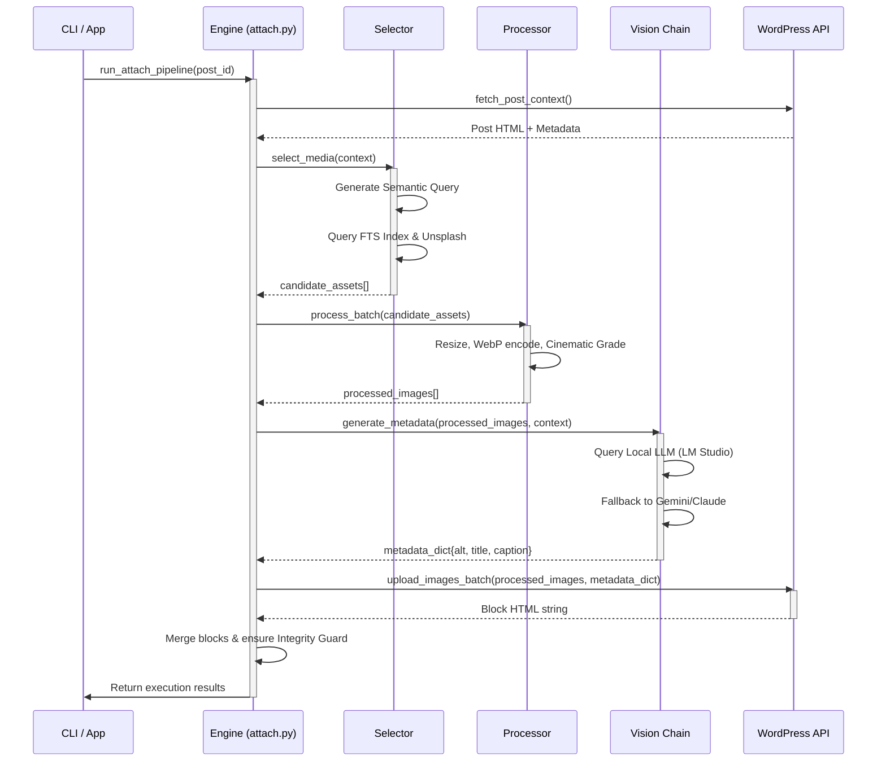
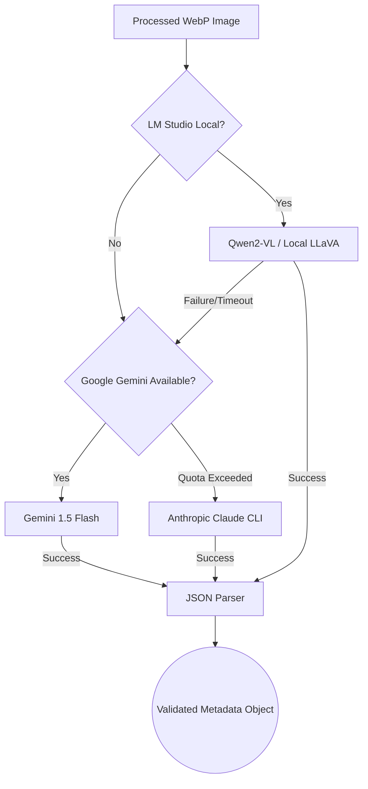

# 🏛 System Architecture

This document describes the high-level architecture of Pictova. It is designed to help developers understand the core abstractions, the data flow, and the reasoning behind structural decisions.

---

## 1. Core Philosophy

Pictova is not just a script; it is a **pipeline-based engine**. It strictly isolates the extraction of data from the transformation and loading of data.

- **Immutability:** Source images are never mutated. Processed images are completely separate artifacts.
- **Stateless Modules:** The engine modules (`selector`, `processor`, `metadata`, `publisher`) receive state, execute their logic, and return a result without side effects.
- **Predictable Degradation:** The Vision Chain gracefully degrades. If Claude goes down, it falls back to Gemini. If the internet goes down, it uses local LLM extraction.

---

## 2. Pipeline Execution Flow

When a user runs `pictova attach`, the execution follows this lifecycle:



---

## 3. Directory Structure

To maintain strict boundary enforcement, the codebase is layered:

```text
src/
├── pictova/
│   ├── app/           # External entrypoints (CLI, HTTP REST APIs, Jobs)
│   ├── engine/        # The brain: pure business logic and the pipeline execution
│   ├── profiles/      # Site-specific configurations (e.g. yoldaolmak.py)
│   └── providers/     # External integrations (WordPress, Unsplash, DepositPhotos)
├── utils/             # Cross-cutting concerns (logging, env parsing)
├── visual_memory/     # Models and logic for the SQLite FTS asset index
└── services/          # Low-level service implementations
```

> [!WARNING]  
> **Strict Layering Rule:** `app/` may import from `engine/`. `engine/` may import from `providers/`. `providers/` and `utils/` cannot import from `engine/`. This prevents circular dependencies and tight coupling.

---

## 4. The Vision Chain

The Vision Chain is the most computationally expensive and complex part of Pictova. It is responsible for generating human-like, SEO-optimized metadata from raw pixels.



### Why fallback?
APIs have rate limits, and network connectivity can fluctuate. By utilizing a **Chain of Responsibility** pattern, Pictova guarantees that every image receives metadata, eliminating pipeline bottlenecks.

---

## 5. Visual Memory Index

The selection phase relies on an extremely fast, offline Full-Text Search (FTS5) index built on SQLite.

Instead of scanning terabytes of images on demand, Pictova maintains `visual_memory.db`.
- **Apple ML Integration:** Apple Photos automatically tags images with `labels` (e.g., "mountain", "sunset"). Pictova extracts these natively.
- **FTS5:** Enables millisecond querying across `location`, `scene`, `activity`, and `camera_model`.

> [!TIP]
> Refer to `docs/concepts/visual-memory.md` for instructions on how to force a rebuild of the visual memory index.
